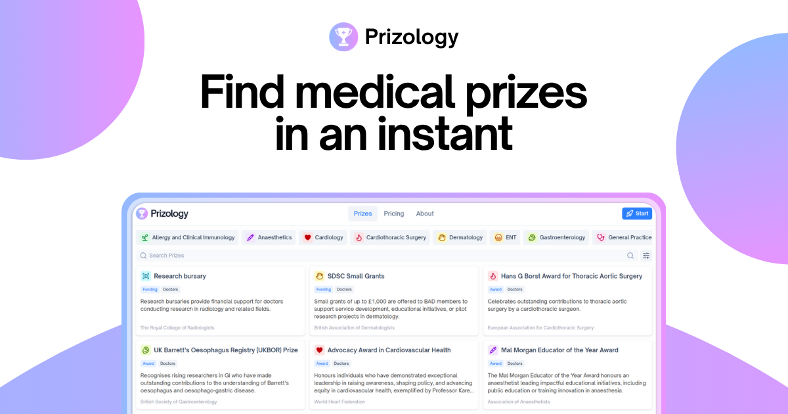

When I started Prizology, the goal was simple: make it easier for students and doctors to find prizes, awards, and bursaries without wasting hours searching through society websites.

But this isn't something that grows alone. That's where ambassadors come in.

Prizology ambassadors help share the platform with peers, shape its future with feedback, and play a part in building something that genuinely helps medical students and doctors get ahead.

Whether you're already an ambassador or interested in becoming one, you'll enjoy unlimited premium access for as long as you're involved, and the chance to be part of a small but passionate community driving change.

Abrar Founder & CEO

